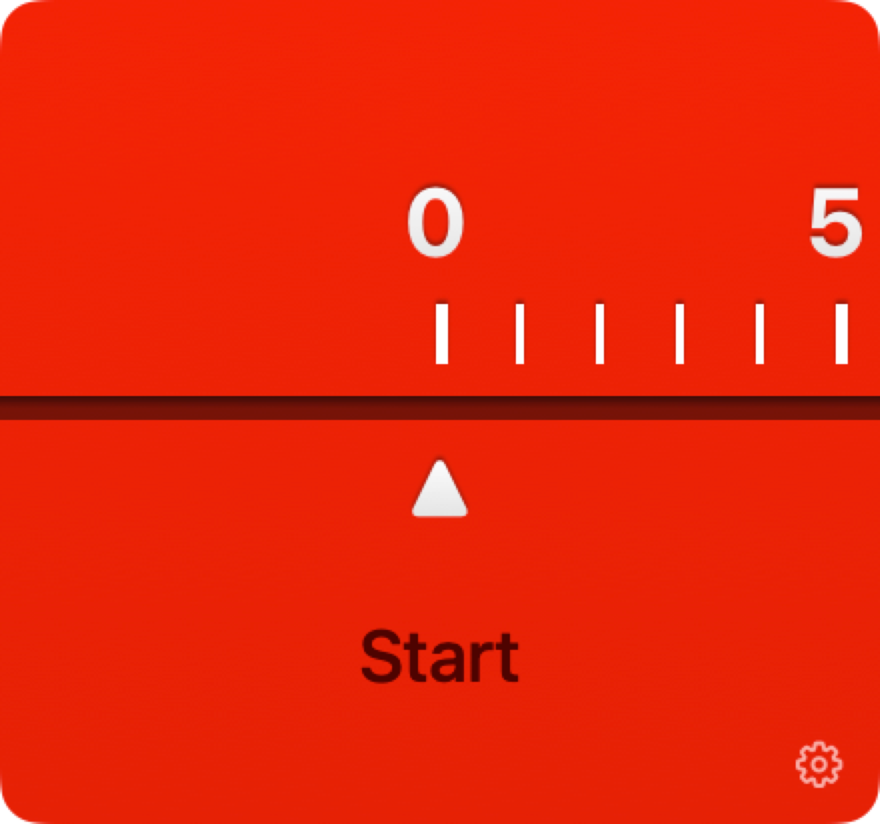

## Mater

[](https://github.com/jasonlong/mater/releases/latest)




A minimal Pomodoro timer that lives in your macOS menu bar. Wind up a work session, take a break, repeat.

### Features

- Sliding ruler with tick marks shows remaining time
- Draggable ruler with momentum physics — flick to set your time
- Configurable work and break durations
- Synthesized windup clicks that match the ruler animation
- Menubar icon counts down minutes remaining
- Liquid Glass button on macOS 26, frosted material on earlier versions
- Keyboard shortcuts: spacebar to play/pause, escape to dismiss
- Sound effects for start, stop, and cycle complete
- Settings for sound, launch at login, and custom durations
- No dock icon, no distractions

### Installation

#### Homebrew

```
brew tap jasonlong/tap
brew install mater
```

#### Manual

Download the latest `.zip` from [Releases](https://github.com/jasonlong/mater/releases), unzip, and drag Mater to Applications.

### Development

Mater is a native Swift app — no dependencies, no package managers.

```
git clone https://github.com/jasonlong/mater
cd mater
xcodebuild -scheme Mater -configuration Debug build -derivedDataPath build/DerivedData
open build/DerivedData/Build/Products/Debug/Mater.app
```

Or open `Mater.xcodeproj` in Xcode and hit Run.

#### Tests

```
xcodebuild test -scheme Mater -derivedDataPath build/DerivedData
```

### What's with the name?

I'm a Pixar fan and Mater is awesome. ["Like Ta-mater without the ta"](https://youtu.be/MJm8vNTasMg?t=25s). Get it?


